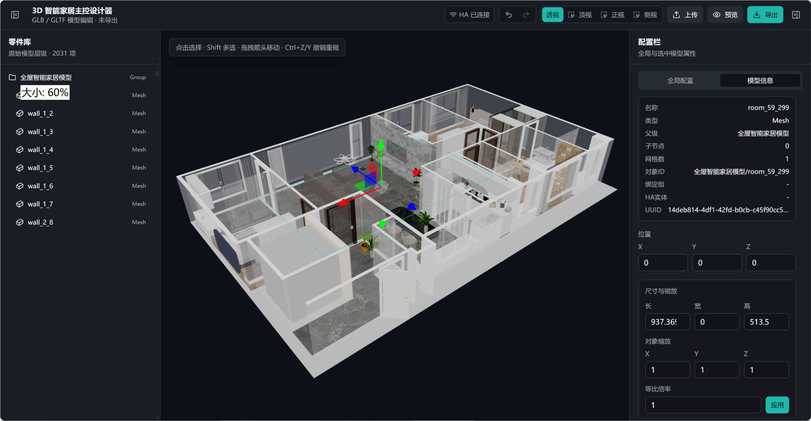
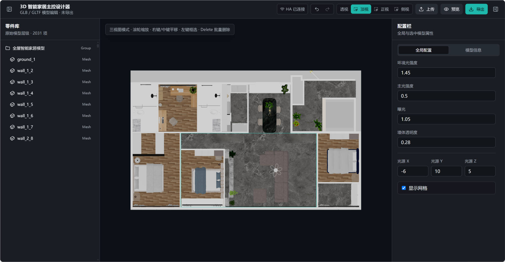
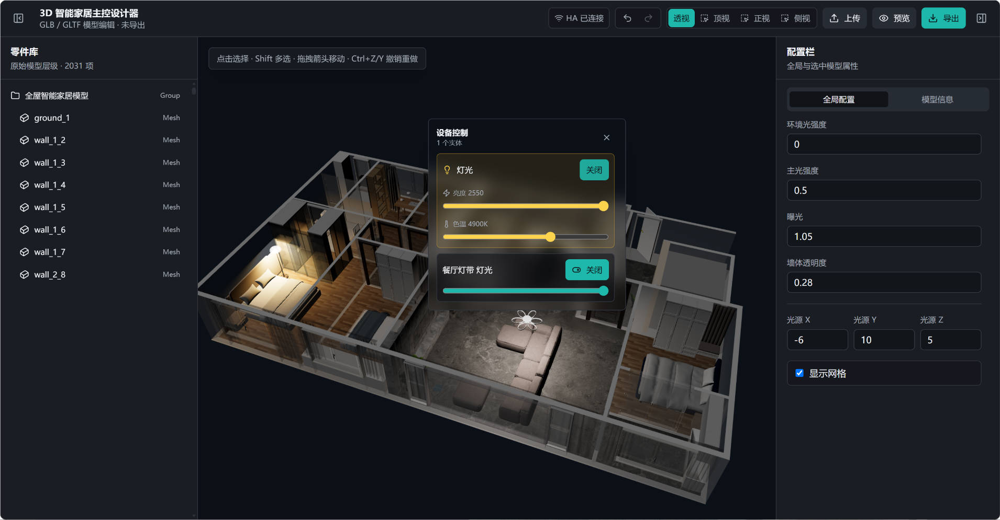
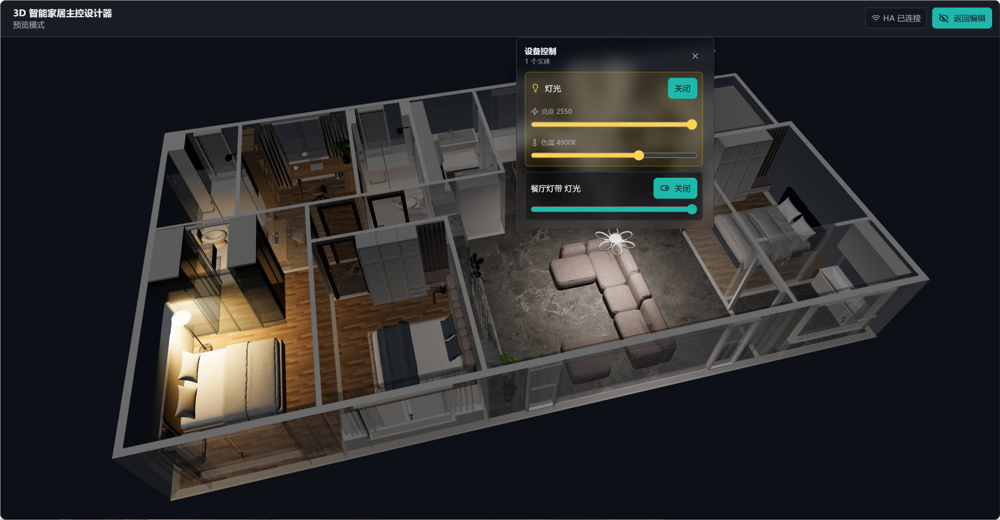
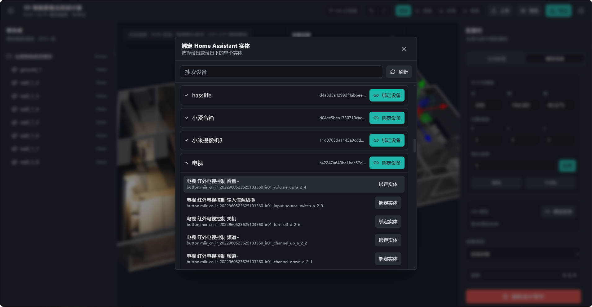
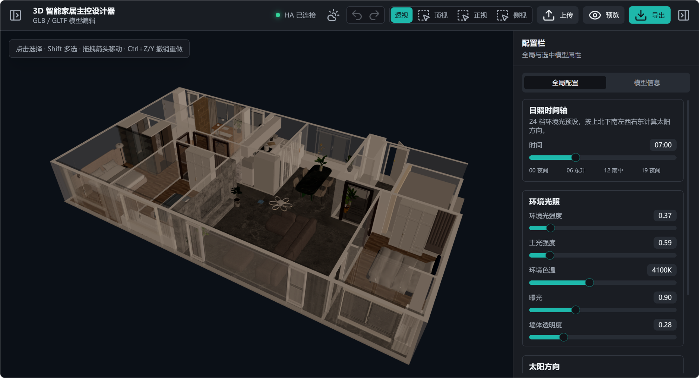
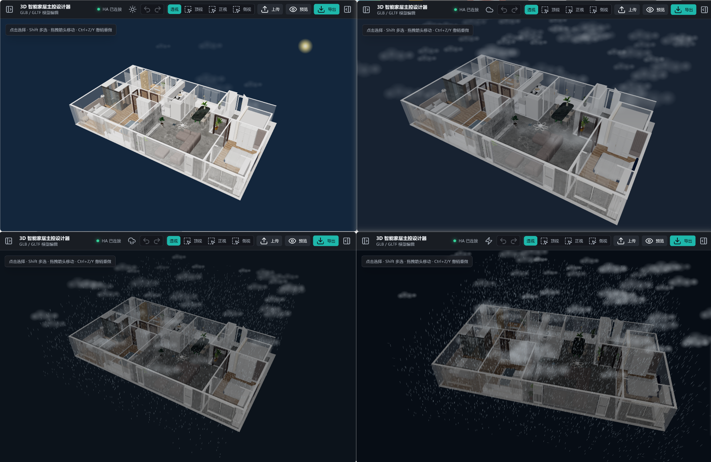

<div align="center">
   
</div>

 [](https://gitee.com/willianfu/3dhomeassistant-editor/stargazers) [](https://gitee.com/willianfu/3dhomeassistant-editor/members)  

# 3DHome Editor

基于 Web 技术的 3D 智能家居模型编辑器。

- 用于加载全屋 GLB/GLTF 模型，查看模型零件层级，并在 3D 视图中选择、移动、删除和导出模型。
- 直连`Homeassistant`，快速编辑绑定实体，双向实时同步设备真实状态，也可直接控制设备。

-----

终极目标是在线直接识别户型图进行建模，并提供大量预设模型/自定义上传，供用户选择构建自己的智慧家，实现3D全屋智能家居数字孪生交互控制😎

------

## 界面一览

#### 模型部件编辑、移动及删除





#### 绑定HA设备，实现设备控制双向同步实时状态







#### 同步时间模拟24H日夜环境



#### 天气环境模拟，接入气象数据与现实同步




## 设备支持

- 灯光 ✔️

- 风扇/新风
- 开关
- 按钮
- 传感器
- 空调
- 地暖
- 摄像头

## 功能特性

- GLB/GLTF 模型上传与加载
- Three.js 3D 渲染视窗，支持透视视角旋转、缩放和点击选择
- 左侧原始模型层级树，使用虚拟滚动承载大型模型
- 右侧环境配置与模型信息面板
- 支持位置编辑、单选删除、导出 GLB
- 顶视、正视、侧视三视图模式
- 三视图下禁用旋转，支持拖拽框选完全框入的可见模型
- 支持批量选择与批量删除
- Draco 解码器内置，支持压缩 GLB
- 天气系统模拟室外天气环境、昼夜
- 绑定HA内的设备实时同步环境

## 技术栈

- Vite
- React
- TypeScript
- Tailwind CSS
- shadcn/ui 风格本地组件
- Three.js
- Vitest

## 快速开始

### 配置HA令牌及连接信息

在项目根目录下创建一个`.env` 环境配置文件，填入下面的信息

```bash
#你的homeassistant地址
VITE_HA_API=http://xxxxx:8123
#你的homeassistant长期访问令牌
VITE_HA_KEY=eyJhbGciOiJIUzI1xxxxx
```

以上信息请自行从HA内获得，如果不体验设备控制功能可不配置

### 启动项目

```bash
npm install
npm run dev
```

打开：

```text
http://127.0.0.1:5173/
```

## 使用说明

1. 点击顶部“上传”，选择 `.glb` 或 `.gltf` 文件（也可点击`加载示例` 按钮，加载演示模型）。
2. 左侧零件树会显示原始模型层级。
3. 点击树节点或 3D 模型可选中零件。
4. 在右侧“模型信息”中查看零件信息或调整位置。
5. 点击“顶视 / 正视 / 侧视”进入三视图模式。
6. 三视图模式下拖拽框选，只有完全被框住的模型会进入批量选择。
7. 按 `Delete` 或点击右侧删除按钮删除选中零件。
8. 点击顶部“导出”导出修改后的 GLB。

## 示例模型

项目包含一个全屋智能家居示例模型：

```text
public/sample/smart-home.glb
```

该模式为手动建模实现，大家可根据自己的需求自行进行户型建模。

## 项目结构

```text
src/
  components/editor/     编辑器 UI
  components/ui/         shadcn/ui 风格基础组件
  lib/                   Three.js 编辑器、模型树、虚拟滚动与工具逻辑
  types/                 共享类型
public/
  draco/                 Draco 解码器
  sample/                示例模型
```


😘感谢`openai.奥特曼`提供支持